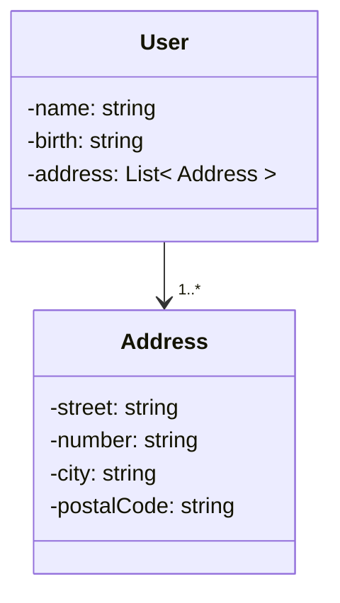

# Person-api
## Description
Project to create and manage personal infos of a person

## Class Diagram



## Requirements
- [Git](https://docs.docker.com/engine/install/ubuntu/)
- [Docker](https://docs.docker.com/engine/install/ubuntu/)


- ## Swagger Doc API Online
Documentation generated with Swagger

https://person-api-doc.up.railway.app/swagger-ui/index.html

OR

## Build and Run the app

## Clone repository
Open terminal and enter the commands
```
mkdir persor-api
cd person-api 
git clone git@github.com:gui-costads/person-api.git
```
## Launch

Build
```
docker build  -t person-api-spring .
```

Run
```
docker run  -p 8080:8080 person-api-spring
```

## Access
```
http://localhost:8080/swagger-ui/index.html
```


## Features
- Get list person
- Create person
- Find person by id
- Create person
- Delete person by id

- Create address to person
- List address of person
- Find address by id 
- Delete address of person

## Built with

[](https://skillicons.dev)
                   
